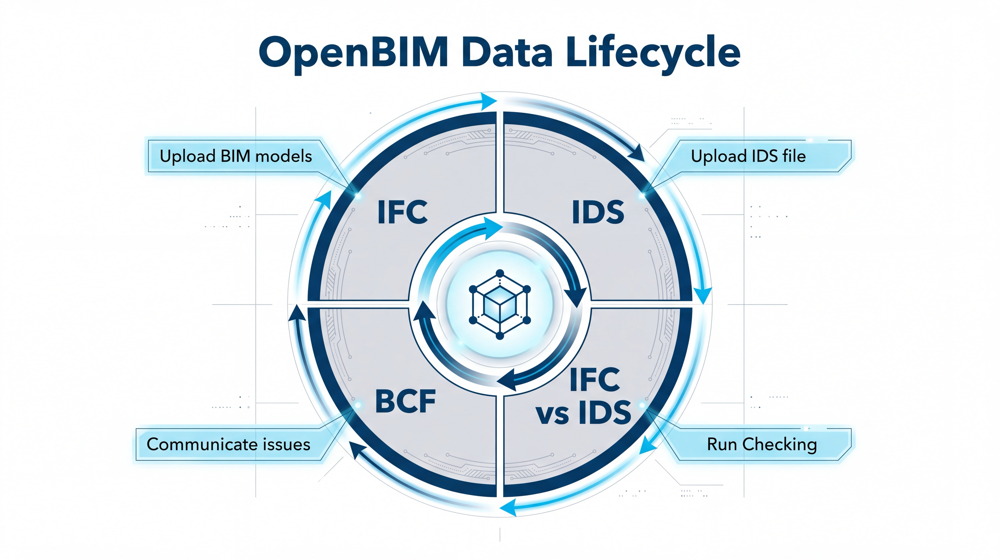

# Construction Timelapse

A **4D / 5D construction-monitoring digital twin** of *Meridian Tower*, built end-to-end on the
**[ArcGIS Maps SDK for JavaScript 5.1](https://developers.arcgis.com/javascript/)**. It streams an
**IFC-authored building model published as Esri I3S**, plays its construction sequence back over
time, audits it **live against a buildingSMART IDS**, tracks real as-built progress in both
schedule (4D) and cost (5D), and overlays **live environmental sensors** from ArcGIS Velocity.

> **openBIM at the core** — the model is **IFC → I3S**, validated against a **buildingSMART
> IDS 1.0** specification in the browser, and findings export to **BCF 2.1**. IFC in, IDS
> checked, BCF out.

## The openBIM data lifecycle

This app is a working slice of the **openBIM data lifecycle**: author the building in **IFC**,
declare the requirements in **IDS**, **check** the model against them, and round-trip the findings
as **BCF** so they flow back into authoring — then the loop repeats.

<p align="center">
  
</p>

| openBIM stage | How **Construction Timelapse** supports it |
| --- | --- |
| **IFC** — author and publish | The tower is authored in IFC (one federated class per building system) and published as Esri **I3S Scene Layers**, streamed straight into a 3D WebScene. |
| **IDS** — define requirements | A buildingSMART **IDS 1.0** file (`ids/construction-timelapse.ids`) is fetched and parsed in the browser. |
| **Run checking** — validate | The published model is audited **live** against the IDS using the I3S per-attribute statistics, scoring every requirement **pass / partial / fail** — failing elements recoloured red down to the individual `GlobalId`. |
| **BCF** — communicate | Findings export to **BCF 2.1** (`.bcfzip`), carrying the issues back into any BCF-aware authoring tool. |
| ↻ **loop** | Resolved issues feed back into the IFC model and the cycle runs again. |

## Highlights

### IFC → I3S building model
The tower was authored in **IFC**, with each building system kept as its own federated IFC
class — `IfcSlab`, `IfcColumn`, `IfcBeam`, `IfcWall`, `IfcPlate`, `IfcRoof`, `IfcCurtainWall` —
and published as Esri **I3S Scene Layers**. The SDK streams that cached I3S straight into a 3D
WebScene, so a full BIM model renders in the browser with no server round-trip and no plugin.

### buildingSMART IDS model audit
An **IDS 1.0** file (`ids/construction-timelapse.ids`) is fetched and parsed in the browser,
then the published scene is audited **live** against it using the I3S precomputed per-attribute
statistics (the same public, CORS-enabled resource the analytics read). Every requirement facet
is scored **pass / partial / fail** against the real element data:

- **Entity & identity** — IFC entity applicability, `GlobalId`, `Name`
- **Predefined type** and **classification** (AssemblyCode / OmniClass)
- **4D scheduling** properties — scheduled phase, planned start / finish, construction status
- **Performance** — fire rating, load-bearing, external, thermal transmittance (U-value)

Expand any specification for a per-layer breakdown; click a spec or layer to **isolate and frame**
the affected geometry in 3D. Failing elements are recoloured red down to the individual `GlobalId`
(via a `UniqueValueRenderer`), compliant ones grey.

### BCF 2.1 export
Audit findings export to a **BCF 2.1** `.bcfzip` (BIM Collaboration Format) with a ghost-highlight
viewer — closing the openBIM loop so issues carry straight back into any BCF-aware authoring tool.

### Planned 4D sequencing (timelapse)
A single **Play** button drives the construction timeline with a smooth, framerate-independent
camera orbit. A headless `TimeSlider` advances time-aware scene layers so the building assembles
slab-by-slab through structure, walls, envelope, roofing and finishes. A live HUD shows
**% complete**, current phase, active-layer count and elapsed / remaining days. Type a date or a
phrase into the **assistant** ("Nov 1 2025", "60%", "halfway", "completion") to jump to that moment.

### Real construction status — 4D schedule + 5D cost
The **as-built** view colour-codes every element by real construction status (installed vs.
due-soon vs. upcoming).

- **Schedule (4D)** — scheduled target vs. effective progress, days behind, overdue count and a
  full status breakdown, filterable by building layer.
- **Financials (5D)** — budget expended, cost-to-date, estimate at completion, **CPI / SPI**
  earned-value health, the current billing draw and open financial risks. Recolour the model
  through cost **lenses** (Budget vs. Actual, current billing cycle, financial risk zones) and
  drill into delay-penalty, delayed-component and change-order risk cards synced to the geometry.
- **AIA report** — generate a formal **AIA G702 / G703** Application for Payment from the live
  figures, exportable to CSV / PDF.

### Live environmental sensors (ArcGIS Velocity)
Real-time **noise, dust, gas and wind** feeds stream in over **ArcGIS Velocity** stream services
and render as small emissive spheres lit by the SDK's WebScene **Glow**, with a gentle breathing
pulse. Click any sensor for a live glass popup; a summary panel and a full site-overview dashboard
track every reading, including a gas **"which gases to watch"** breakdown that names the elevated
drivers.

### Experience
Custom hit-test tooltips, a sectioned help guide on every screen, an SDK slice / cut-plane tool
and one-touch camera spin, over a dark, high-contrast theme (WCAG-tuned).

## Views

| Page | View |
| --- | --- |
| `index.html` | Planned construction sequencing (4D timelapse) + IDS audit |
| `progress.html` | Real construction status (4D schedule + 5D cost) + live sensors |
| `report.html` | AIA G702 / G703 Application for Payment |
| `login.html` | Entry gate |

## Built on the ArcGIS Maps SDK for JavaScript 5.1

The whole app is written directly against the
**[ArcGIS Maps SDK for JavaScript 5.1](https://developers.arcgis.com/javascript/)**, loaded as ES
modules from the CDN via an import map — no build step, no framework. It leans on the SDK's 5.x 3D
stack throughout:

- **`WebScene` + `SceneView`** — the 3D digital twin, camera control and cinematic orbit (`view.goTo`)
- **I3S `SceneLayer`s** — the IFC-derived building model streamed as cached 3D object layers
- **Headless `TimeSlider` + time-aware layers** — the 4D construction sequence
- **`esriRequest` against the I3S per-attribute statistics** — the live IDS audit and progress
  analytics, with no server round-trip
- **`UniqueValueRenderer` / `SimpleRenderer` + `MeshSymbol3D`** — recolouring elements by IDS
  pass / fail and construction status, down to individual `GlobalId`s
- **3D object sphere symbols with emissive material + WebScene `Glow`** — the glowing Velocity
  sensor orbs
- **`view.hitTest` + layer-view `highlight`** — click-to-inspect popups and tooltips
- **Slice (cut-plane) analysis** — look straight inside the model

### Also uses

- **buildingSMART openBIM** — IFC, IDS 1.0, BCF 2.1
- **ArcGIS Velocity** — real-time sensor stream services
- Vanilla JavaScript (ES modules), HTML and CSS

## Run locally

ES modules must be served over HTTP (not opened from `file://`). Any static server works:

```bash
# Python 3
python -m http.server 5533
```

Then open <http://localhost:5533/login.html>.

## Project structure

```
construction-timelapse/
├─ login.html                      Entry gate
├─ index.html                      Planned 4D sequencing + IDS audit
├─ progress.html                   Real status (4D) + 5D cost + live sensors
├─ report.html                     AIA G702/G703 Application for Payment
├─ css/styles.css                  Design tokens + UI theme + ArcGIS widget overrides
├─ ids/construction-timelapse.ids  buildingSMART IDS 1.0 specification
├─ docs/velocity/                  ArcGIS Velocity feed data + generator
├─ assets/                         Logos + diagrams
└─ js/
   ├─ app.js · scene.js · config.js             Boot · WebScene/SceneView · configuration
   ├─ cinematic.js · spin.js                    Timeline playback · camera orbit
   ├─ dashboard.js · layers.js · slice.js       Planned HUD · layer isolation · cut-plane
   ├─ interaction.js · visibility.js            Hit-test tooltips · ghosting
   ├─ assistant.js · help.js · help-content.js  Natural-language jump · help guide
   ├─ ids.js · audit.js                         IDS parse · live model audit
   ├─ bcfExport.js · bcfViewer.js               BCF 2.1 export · ghost-highlight viewer
   ├─ progress*.js · progress-stats.js          Real-status dashboard · 5D financials · cost lenses
   └─ velocity.js · velocity-live.js · progress-sensors.js   Velocity sensors · glowing orbs · panels
```

## openBIM & credits

Built with the ArcGIS Maps SDK for JavaScript. Interoperability follows **buildingSMART** openBIM
standards — **IFC**, **IDS** and **BCF**. Esri and ArcGIS are trademarks of Esri; buildingSMART,
IFC, IDS and BCF are trademarks of buildingSMART International. Figures shown are illustrative
demo data.
