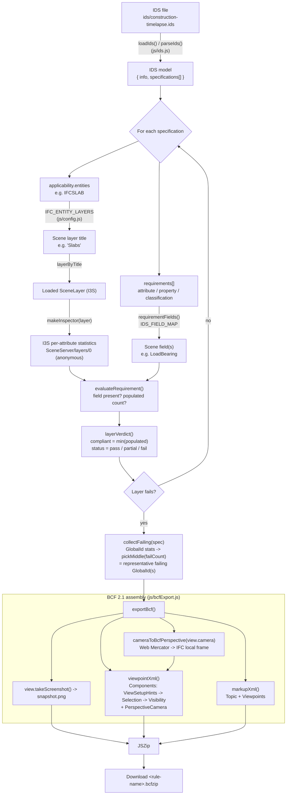
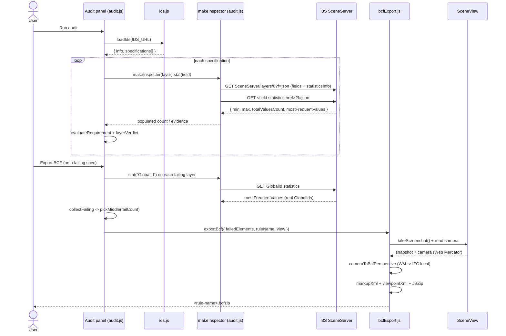

# From IDS to BCF — Model‑Audit Issue Export Workflow

How the app turns a **buildingSMART IDS** requirement failure, measured against
**ArcGIS I3S scene layers**, into a portable **BCF 2.1** issue that opens in any
BCF‑capable desktop tool (verified in BIMVision).

> **Scope.** This documents the live pipeline in `js/ids.js`, `js/audit.js` and
> `js/bcfExport.js` (plus `js/config.js`, `js/scene.js`). It is a description of
> what the shipped code does, a set of diagrams, and a distilled reference
> implementation you can lift and repeat.

---

## 1. TL;DR

```
IDS (.ids XML)
   │  parse
   ▼
Specifications ── applicability (IFC entity) ──▶ WebScene SceneLayer (I3S)
   │                                                     │
   │  requirements (attribute / property / classification)
   ▼                                                     ▼
Evaluate each requirement against the layer's per‑attribute STATISTICS
   │  (field present?  how many elements populate it?)
   ▼
Per‑layer verdict: pass / partial / fail  +  compliant count
   │  (for a failing layer)
   ▼
Pick the failing element GlobalId(s) from the layer's GlobalId statistics
   │  (representative sample — see §10; identical to the 3D highlight)
   ▼
Build BCF 2.1 issue:
   bcf.version + <guid>/markup.bcf + <guid>/viewpoint.bcfv + <guid>/snapshot.png
   • viewpoint.bcfv <Selection> lists the GlobalId(s) as <Component IfcGuid=…>
   • PerspectiveCamera = SceneView camera mapped Web Mercator → IFC local frame
   ▼
Download <rule-name>.bcfzip
```

---

## 2. Is this what actually happens? (confirmation + the key nuance)

**Yes.** The BCF is created from the I3S component that the IDS audit flags. The
one nuance worth stating plainly for an openBIM audience:

- The published I3S 3D‑object layers expose **aggregate per‑attribute
  statistics** (min/max, populated counts, `mostFrequentValues`) but **do not
  support per‑feature queries** (`queryFeatures` / `queryObjectIds` return
  nothing — `serviceCapabilities: None`).
- Therefore the audit determines **how many** elements fail a rule from
  statistics, and the failing element written into the BCF `<Selection>` is a
  **real `GlobalId` sampled from the layer's statistics** (a representative
  "middle" pick for a partial failure), **not** an individually‑queried failing
  instance.
- That sampled `GlobalId` is deliberately the **same** id the "Highlight failing
  in 3D" review paints red, so the BCF selection and the on‑screen highlight are
  always consistent.

If/when the model is served from a queryable layer (Feature/Scene layer with
query capability), swapping the statistics sample for an exact
`queryFeatures(where = <fail clause>)` is the only change needed — the
`where` clause is already built (`specFailingWhere`, see §10).

---

## 3. Component map

| File | Role in this workflow |
|------|-----------------------|
| `ids/construction-timelapse.ids` | The buildingSMART IDS 1.0 source document being audited. |
| `js/ids.js` | `loadIds()` / `parseIds()` — fetch + parse the IDS XML into a plain JS model (specs → applicability + requirements). |
| `js/config.js` | Static maps: IFC entity → scene‑layer title (`IFC_ENTITY_LAYERS`), IDS facet name → scene field (`IDS_FIELD_MAP`), classification fields (`IDS_CLASSIFICATION_FIELDS`). |
| `js/scene.js` | Builds the `WebScene` + `SceneView` the audit reads and the BCF snapshots. |
| `js/audit.js` | The audit engine: layer inspectors over I3S statistics, requirement evaluation, verdicts, the review/highlight UI, and the **BCF export trigger** (`collectFailing` → `exportBcf`). |
| `js/bcfExport.js` | Pure BCF 2.1 builder: camera↔perspective conversion (incl. the Web Mercator → IFC‑local georeference), XML for `bcf.version` / `markup.bcf` / `viewpoint.bcfv`, and the JSZip packaging + download. |
| `js/bcfViewer.js` | Consumes a BCF perspective to fly the `SceneView` to a viewpoint (uses the inverse transform). |

---

## 4. Workflow diagram



## 5. Sequence diagram



---

## 6. Stage‑by‑stage detail

### 6.1 Parse the IDS — `js/ids.js`

`loadIds(url)` fetches the `.ids` file and `parseIds(text)` turns it into a
plain model. It matches on `localName` (the IDS default namespace is
`http://standards.buildingsmart.org/IDS`) and extracts only the facets the app
can evaluate:

```js
// Result shape
{
  info: { title, version, description, author, date, purpose, milestone },
  specifications: [
    {
      name, identifier, description, instructions, ifcVersion,
      applicability: { entities: ["IFCSLAB", ...] },   // upper-cased entity names
      requirements: [
        { kind: "attribute",       name, cardinality },
        { kind: "property",        propertySet, baseName, dataType, allowedValues, cardinality },
        { kind: "classification",  system: [...], cardinality }
      ]
    }
  ]
}
```

`cardinality` defaults to `"required"`; `"optional"` requirements are ignored in
the verdict. Anything the parser doesn't understand is skipped gracefully.

### 6.2 Resolve specifications to scene layers — `js/audit.js`

`createAudit()` builds a `layerByTitle` map by matching the WebScene's loaded
layers to the titles in `IFC_ENTITY_LAYERS`. Then, per spec:

```js
const titles = [...new Set(
  spec.applicability.entities.map((e) => IFC_ENTITY_LAYERS[e]).filter(Boolean)
)];
// each title -> layerByTitle.get(title) -> a loaded SceneLayer
```

So an IDS spec applicable to `IFCSLAB` is audited against the **Slabs** scene
layer, `IFCWALL` against **Walls**, etc. (full table in §7).

### 6.3 Evaluate requirements against I3S statistics — `js/audit.js`

`makeInspector(layer)` lazily fetches, for one layer:
- the layer resource `…/SceneServer/layers/0?f=json` → the field list and each
  field's `statisticsInfo` href;
- per‑field statistics on demand (`{ min, max, totalValuesCount, histogram,
  mostFrequentValues }`) via `esriRequest`, **anonymously**.

`evaluateRequirement(req, inspector, elementCount)`:
- maps the requirement to candidate scene field(s) with `requirementFields()`
  (a classification is an **OR** across `IDS_CLASSIFICATION_FIELDS`);
- a field is satisfied when it is **present** and **populated** (`populated` =
  count of non‑null values derived from the stats payload);
- `populated` for the requirement = max across candidate fields; evidence text
  is taken from the first populated candidate.

`layerVerdict(elementCount, results)`:
```js
compliant = min(populated across required requirements)   // worst requirement wins
status    = "fail"    if any required field missing OR compliant === 0
          = "partial" if compliant < elementCount
          = "pass"    otherwise
```

Spec‑level aggregation: `applicable` and `compliant` are summed across the
spec's layers; a spec is `fail` if nothing is compliant, `partial` if any layer
is not a full pass, else `pass`.

### 6.4 Identify the failing component(s) — `js/audit.js` `collectFailing`

For each **failing** layer, read the `GlobalId` statistics and select a
representative sample sized to the failure count:

```js
const s   = await makeInspector(layer).stat("GlobalId");
const all = (s.stats?.mostFrequentValues ?? []).map(v => v.value).filter(Boolean);
const failCount = Math.max(0, layer.elementCount - layer.compliant);
const chosen = (failCount > 0 && failCount < layer.elementCount)
  ? pickMiddle(all, Math.min(failCount, all.length))   // partial fail: middle slice
  : all;                                                // whole layer fails: full sample
```

`pickMiddle(arr, n)` returns `n` items from the centre of the array. The result
is deduplicated in `exportBcf` (a `Set` on `GlobalId`), so a `<Component>` never
repeats. See §10 for why this is a sample rather than an exact query.

### 6.5 Build the BCF — `js/bcfExport.js` `exportBcf`

```js
const guids = [...new Set(failedElements.map(guidOf).filter(Boolean))];
const shot  = await view.takeScreenshot({ width: 800, height: 600, format: "png" });
const persp = cameraToBcfPerspective(view.camera);   // WM -> IFC local (see §9)

const zip = new JSZip();
zip.file("bcf.version", bcfVersionXml());
const dir = zip.folder(topicGuid);
dir.file("markup.bcf",    markupXml({ topicGuid, viewpointGuid, title, description, author, date }));
dir.file("viewpoint.bcfv", viewpointXml({ viewpointGuid, guids, perspective: persp }));
dir.file("snapshot.png",   snapshotBase64, { base64: true });
const blob = await zip.generateAsync({ type: "blob" });   // -> download <rule>.bcfzip
```

The full BCF layout and example XML are in §8.

---

## 7. Data mappings (from `js/config.js`)

**IFC entity → WebScene layer title** (`IFC_ENTITY_LAYERS`):

| IDS applicability entity | Scene layer title |
|--------------------------|-------------------|
| `IFCSLAB` | Slabs |
| `IFCCOLUMN` | Columns |
| `IFCBEAM` | Structural Framing |
| `IFCWALL` | Walls |
| `IFCPLATE` | Plates |
| `IFCROOF` | Roofs |
| `IFCCURTAINWALL` | Curtain Wall Panels |

**IDS facet name → scene field** (`IDS_FIELD_MAP`, selected):

| IDS name | Scene field |
|----------|-------------|
| `GlobalId` | `GlobalId` |
| `Name` | `Name` |
| `PredefinedType` | `PreDefinedType` |
| `FireRating` | `FireRating` |
| `LoadBearing` | `LoadBearing` |
| `IsExternal` | `IsExternal` |
| `ThermalTransmittance` | `ThermalTransmittance` |
| `ScheduledPhase` | `Sched_Phase` |
| `PlannedStartDate` | `Sched_StartDate` |
| `PlannedFinishDate` | `Sched_EndDate` |
| `ConstructionStatus` | `CStatus` |

**Classification** is satisfied if **any** of `IDS_CLASSIFICATION_FIELDS`
(`AssemblyCode`, `OmniClass`) carries a value.

---

## 8. The BCF output

**Zip layout** (`.bcfzip`, BCF 2.1):

```
bcf.version
<topicGuid>/markup.bcf
<topicGuid>/viewpoint.bcfv
<topicGuid>/snapshot.png
```

**`bcf.version`**

```xml
<?xml version="1.0" encoding="UTF-8"?>
<Version VersionId="2.1" xmlns:xsi="http://www.w3.org/2001/XMLSchema-instance">
  <DetailedVersion>2.1</DetailedVersion>
</Version>
```

**`markup.bcf`**

```xml
<?xml version="1.0" encoding="UTF-8"?>
<Markup xmlns:xsi="http://www.w3.org/2001/XMLSchema-instance">
  <Topic Guid="<topicGuid>" TopicType="Issue" TopicStatus="Open">
    <Title><rule name></Title>
    <CreationDate><ISO date></CreationDate>
    <CreationAuthor>ids-audit@construction-timelapse</CreationAuthor>
    <Description><n element(s) fail … camera/snapshot captured …></Description>
  </Topic>
  <Viewpoints Guid="<viewpointGuid>">
    <Viewpoint>viewpoint.bcfv</Viewpoint>
    <Snapshot>snapshot.png</Snapshot>
  </Viewpoints>
</Markup>
```

**`viewpoint.bcfv`** (the identified component + pinned camera)

```xml
<?xml version="1.0" encoding="UTF-8"?>
<VisualizationInfo xmlns:xsi="http://www.w3.org/2001/XMLSchema-instance" Guid="<viewpointGuid>">
  <Components>
    <ViewSetupHints SpacesVisible="false" SpaceBoundariesVisible="false" OpeningsVisible="false" />
    <Selection>
      <Component IfcGuid="0Rsh6r8an3TQ3Bw8LKOhf5" />
    </Selection>
    <Visibility DefaultVisibility="true" />
  </Components>
  <PerspectiveCamera>
    <CameraViewPoint><X>-24.017</X><Y>23.940</Y><Z>102.970</Z></CameraViewPoint>
    <CameraDirection><X>0.2855</X><Y>-0.8354</Y><Z>-0.4696</Z></CameraDirection>
    <CameraUpVector><X>0.1519</X><Y>-0.4444</Y><Z>0.8829</Z></CameraUpVector>
    <FieldOfView>55</FieldOfView>
  </PerspectiveCamera>
</VisualizationInfo>
```

**Schema order matters.** Inside `<Components>` the BCF 2.1 schema
(`visinfo.xsd`) fixes the order `ViewSetupHints? → Selection? → Visibility
(required) → Coloring?`. `<Selection>` is emitted only when there is at least
one `GlobalId` (an empty `<Selection/>` is schema‑invalid). `<ViewSetupHints>`
allows **only** `SpacesVisible` / `SpaceBoundariesVisible` / `OpeningsVisible`.
`FieldOfView` is clamped to 45–60.

---

## 9. The camera transform (Web Mercator → IFC local)

The scene is published in **Web Mercator** (`wkid 102100`, vertical EGM96), so
`view.camera.position` arrives as easting/northing in the **millions**. IFC/BCF
desktop tools expect the model's **local engineering frame** (small metres near
the project origin). `bcfExport.js` maps between them with a single anchor:

```js
const MODEL_GEOREF = {
  originX: 958890.58,   // Web Mercator X of IFC (0,0)   — from the Slabs layer extent centre
  originY: 6010426.04,  // Web Mercator Y of IFC (0,0)
  originZ: 442.85,      // height (EGM96 m) of IFC z = 0  — Slabs extent zmin
  rotationDeg: 0        // IFC +X east of grid north (0 = model aligned to true north)
};

// Web Mercator inflates ground distance by sec(latitude); undo it with cos(lat):
const WM_SCALE = Math.cos(webMercatorLat(MODEL_GEOREF.originY));  // ≈ 0.67666 at this site

function toModelLocal(pos) {                 // Web Mercator -> IFC local metres
  const dx = (pos.x - MODEL_GEOREF.originX) * WM_SCALE;
  const dy = (pos.y - MODEL_GEOREF.originY) * WM_SCALE;
  const c = Math.cos(GEOREF_RAD), s = Math.sin(GEOREF_RAD);
  return { x: dx * c + dy * s, y: -dx * s + dy * c, z: (pos.z ?? 0) - MODEL_GEOREF.originZ };
}
```

Direction/up vectors are built in East‑North‑Up (which equals the Web Mercator
grid — no meridian convergence) and rotated by `rotationDeg` into the IFC frame;
with `rotationDeg = 0` they are unchanged. `fromModelLocal()` is the exact
inverse and is used by `bcfViewer.js` to fly the `SceneView` to an imported
viewpoint (round‑trip is lossless).

> **Georeference accuracy.** `originX/Y/Z` are currently **estimated** from the
> public Slabs layer extent (origin = footprint centre, rotation = 0). Verified
> to frame the model correctly in BIMVision. To make it exact, set `MODEL_GEOREF`
> from the source model's **Project Base Point / Survey Point** (real‑world
> E/N/elev, projected to Web Mercator) plus its **Angle to True North**; or solve
> it from one `(exported Web Mercator camera ↔ correct local camera)`
> correspondence for the same view.

---

## 10. Constraints, caveats & assumptions

- **I3S is statistics‑only here.** These cached 3D‑object scene layers serve
  aggregate statistics but not per‑feature queries, and client‑side effects like
  `layer.opacity` / `FeatureEffect` / `layerView.highlight` don't render on them.
  Reliable primitives: `layer.visible`, `layer.renderer` (recolour), and the REST
  statistics endpoint. This is why failing elements are (a) sampled from
  `GlobalId` statistics for the BCF and (b) recoloured via a
  `UniqueValueRenderer` for the 3D highlight.
- **Representative, not exact, failing instance.** For a partial failure the
  written `GlobalId` is a real id sampled from the layer, not necessarily *the*
  slab that fails — but it is the same id shown in 3D. The exact `where` clause
  that *would* isolate failures already exists (`specFailingWhere` → per‑field
  `IS NULL` OR‑clause); point it at a queryable layer to make the selection
  exact.
- **Requirement = "field populated".** The audit treats a requirement as met
  when the mapped scene field carries a value; it does not currently enforce
  IDS value restrictions (enumerations/patterns) beyond presence.
- **BCF 2.1 schema strictness.** Component ordering, non‑empty `<Selection>`,
  restricted `<ViewSetupHints>` attributes, and 45–60° `FieldOfView` are all
  required for `visinfo.xsd` validity (see §12).
- **Cache‑busting.** ES modules are imported with `?v=N` query strings; any
  change to a module requires bumping its version in every importer up the chain
  (`bcfExport → audit/bcfViewer → app → index.html`).

---

## 11. Reproducible reference implementation

A dependency‑light distillation of the shipped pipeline. Browser side needs
`@arcgis/core` (`esriRequest`, a `SceneView`) and `jszip`; the XML/camera helpers
are pure and portable. Full source: `js/ids.js`, `js/audit.js`, `js/bcfExport.js`.

```js
import esriRequest from "@arcgis/core/request.js";
import JSZip from "jszip";
import { loadIds } from "./ids.js";

// --- config (mirror of js/config.js) ---------------------------------------
const IFC_ENTITY_LAYERS = {
  IFCSLAB: "Slabs", IFCCOLUMN: "Columns", IFCBEAM: "Structural Framing",
  IFCWALL: "Walls", IFCPLATE: "Plates", IFCROOF: "Roofs",
  IFCCURTAINWALL: "Curtain Wall Panels"
};
const IDS_FIELD_MAP = { PredefinedType: "PreDefinedType", ConstructionStatus: "CStatus" /* … */ };
const IDS_CLASSIFICATION_FIELDS = ["AssemblyCode", "OmniClass"];

// --- 1. layer statistics inspector -----------------------------------------
function layerResourceUrl(layer) {
  const base = (layer.url || "").replace(/\/+$/, "");
  return /\/layers\/\d+$/.test(base) ? base : `${base}/layers/${layer.layerId ?? 0}`;
}
function makeInspector(layer) {
  const resource = layerResourceUrl(layer);
  let meta; const cache = new Map();
  const getMeta = () => (meta ??= esriRequest(resource, { query: { f: "json" }, responseType: "json" })
    .then(r => ({
      fields: new Set((r.data.fields ?? []).map(f => f.name)),
      hrefs:  new Map((r.data.statisticsInfo ?? []).map(s => [s.name, s.href]))
    })));
  async function stat(field) {
    if (cache.has(field)) return cache.get(field);
    const p = (async () => {
      const { fields, hrefs } = await getMeta();
      if (!fields.has(field) || !hrefs.get(field)) return { hasField: fields.has(field), populated: 0, stats: null };
      const url = new URL(hrefs.get(field), `${resource}/`).toString();
      const r = await esriRequest(url, { query: { f: "json" }, responseType: "json" });
      const st = r.data?.stats ?? r.data ?? {};
      const populated = st.totalValuesCount
        ?? (st.mostFrequentValues ?? []).reduce((n, v) => n + (v.count || 0), 0);
      return { hasField: true, populated, stats: st };
    })().catch(() => ({ hasField: false, populated: 0, stats: null }));
    cache.set(field, p); return p;
  }
  async function count() {
    for (const f of ["GlobalId", "Name", "PreDefinedType"]) {
      const s = await stat(f); if (s.populated) return s.populated;
    }
    return 0;
  }
  return { stat, count };
}

// --- 2. requirement -> field(s) --------------------------------------------
const requirementFields = (req) =>
  req.kind === "classification" ? IDS_CLASSIFICATION_FIELDS.slice()
  : [IDS_FIELD_MAP[req.name ?? req.baseName] ?? (req.name ?? req.baseName)];

// --- 3. evaluate a spec against its layers ---------------------------------
async function auditSpec(spec, layerByTitle) {
  const titles = [...new Set(spec.applicability.entities.map(e => IFC_ENTITY_LAYERS[e]).filter(Boolean))];
  const layers = [];
  for (const title of titles) {
    const layer = layerByTitle.get(title); if (!layer) continue;
    const insp = makeInspector(layer);
    const elementCount = await insp.count();
    const required = spec.requirements.filter(r => r.cardinality !== "optional");
    let missing = false, compliant = elementCount;
    for (const req of required) {
      const stats = await Promise.all(requirementFields(req).map(f => insp.stat(f)));
      const hasField  = stats.some(s => s.hasField);
      const populated = stats.reduce((m, s) => Math.max(m, s.populated), 0);
      if (!hasField) missing = true;
      compliant = Math.min(compliant, populated);
    }
    const status = (missing || compliant === 0) ? "fail" : compliant < elementCount ? "partial" : "pass";
    layers.push({ title, layer, elementCount, compliant, status });
  }
  return { ...spec, layers };
}

// --- 4. identify failing GlobalIds from statistics -------------------------
const pickMiddle = (a, n) => n >= a.length ? a.slice()
  : a.slice(Math.floor((a.length - n) / 2), Math.floor((a.length - n) / 2) + n);

async function collectFailing(spec) {
  const guids = [];
  for (const L of spec.layers.filter(l => l.status !== "pass")) {
    const s = await makeInspector(L.layer).stat("GlobalId");
    const all = (s.stats?.mostFrequentValues ?? []).map(v => v.value).filter(Boolean);
    const failCount = Math.max(0, L.elementCount - L.compliant);
    const chosen = (failCount > 0 && failCount < L.elementCount)
      ? pickMiddle(all, Math.min(failCount, all.length)) : all;
    guids.push(...chosen);
  }
  return [...new Set(guids)];
}

// --- 5. camera: Web Mercator -> IFC local ----------------------------------
const MODEL_GEOREF = { originX: 958890.58, originY: 6010426.04, originZ: 442.85, rotationDeg: 0 };
const EARTH_R = 6378137;
const webMercatorLat = (y) => 2 * Math.atan(Math.exp(y / EARTH_R)) - Math.PI / 2;
const WM_SCALE  = Math.cos(webMercatorLat(MODEL_GEOREF.originY));
const GEOREF_RAD = MODEL_GEOREF.rotationDeg * Math.PI / 180;
const norm = (v) => { const l = Math.hypot(v.x, v.y, v.z) || 1; return { x: v.x/l, y: v.y/l, z: v.z/l }; };
const cross = (a, b) => ({ x: a.y*b.z - a.z*b.y, y: a.z*b.x - a.x*b.z, z: a.x*b.y - a.y*b.x });
const clamp = (n, lo, hi) => Math.min(hi, Math.max(lo, n));
const rotateToModel = (v) => { const c = Math.cos(GEOREF_RAD), s = Math.sin(GEOREF_RAD);
  return { x: v.x*c + v.y*s, y: -v.x*s + v.y*c, z: v.z }; };
function toModelLocal(p) {
  const dx = (p.x - MODEL_GEOREF.originX) * WM_SCALE, dy = (p.y - MODEL_GEOREF.originY) * WM_SCALE;
  const c = Math.cos(GEOREF_RAD), s = Math.sin(GEOREF_RAD);
  return { x: dx*c + dy*s, y: -dx*s + dy*c, z: (p.z ?? 0) - MODEL_GEOREF.originZ };
}
function cameraToBcfPerspective(cam) {
  const h = (cam.heading ?? 0) * Math.PI/180, t = (cam.tilt ?? 0) * Math.PI/180;
  const dir = norm({ x: Math.sin(t)*Math.sin(h), y: Math.sin(t)*Math.cos(h), z: -Math.cos(t) });
  let right = cross(dir, { x:0, y:0, z:1 }); if (Math.hypot(right.x,right.y,right.z) < 1e-6) right = { x:1, y:0, z:0 };
  const up = norm(cross(norm(right), dir));
  return { viewPoint: toModelLocal(cam.position), direction: rotateToModel(dir),
           up: rotateToModel(up), fieldOfView: clamp(cam.fov ?? 60, 45, 60) };
}

// --- 6. BCF XML + zip ------------------------------------------------------
const esc = (s) => String(s ?? "").replace(/&/g,"&amp;").replace(/</g,"&lt;").replace(/>/g,"&gt;").replace(/"/g,"&quot;");
const vec = (tag, v) => `<${tag}><X>${v.x}</X><Y>${v.y}</Y><Z>${v.z}</Z></${tag}>`;
const viewpointXml = ({ viewpointGuid, guids, perspective: p }) => {
  const selection = guids.length
    ? `    <Selection>\n${guids.map(g => `      <Component IfcGuid="${esc(g)}" />`).join("\n")}\n    </Selection>\n` : "";
  return `<?xml version="1.0" encoding="UTF-8"?>
<VisualizationInfo xmlns:xsi="http://www.w3.org/2001/XMLSchema-instance" Guid="${viewpointGuid}">
  <Components>
    <ViewSetupHints SpacesVisible="false" SpaceBoundariesVisible="false" OpeningsVisible="false" />
${selection}    <Visibility DefaultVisibility="true" />
  </Components>
  <PerspectiveCamera>
    ${vec("CameraViewPoint", p.viewPoint)}
    ${vec("CameraDirection", p.direction)}
    ${vec("CameraUpVector", p.up)}
    <FieldOfView>${p.fieldOfView}</FieldOfView>
  </PerspectiveCamera>
</VisualizationInfo>`;
};

async function exportBcf({ guids, ruleName, view }) {
  const topicGuid = crypto.randomUUID(), viewpointGuid = crypto.randomUUID();
  const shot = await view.takeScreenshot({ width: 800, height: 600, format: "png" });
  const persp = cameraToBcfPerspective(view.camera);
  const zip = new JSZip();
  zip.file("bcf.version",
    `<?xml version="1.0" encoding="UTF-8"?>\n<Version VersionId="2.1"><DetailedVersion>2.1</DetailedVersion></Version>`);
  const dir = zip.folder(topicGuid);
  dir.file("markup.bcf", /* Topic + Viewpoints, see §8 */ "");
  dir.file("viewpoint.bcfv", viewpointXml({ viewpointGuid, guids, perspective: persp }));
  dir.file("snapshot.png", shot.dataUrl.split(",")[1], { base64: true });
  return zip.generateAsync({ type: "blob" });   // -> download as <ruleName>.bcfzip
}

// --- 7. end-to-end ---------------------------------------------------------
async function run(view, scene) {
  const ids = await loadIds("./ids/construction-timelapse.ids");
  const layerByTitle = new Map();
  for (const title of Object.values(IFC_ENTITY_LAYERS)) {
    const layer = scene.allLayers.find(l => l.title === title);
    if (layer) layerByTitle.set(title, layer);
  }
  for (const specDef of ids.specifications) {
    const spec = await auditSpec(specDef, layerByTitle);
    if (spec.layers.some(l => l.status !== "pass")) {
      const guids = await collectFailing(spec);
      const blob  = await exportBcf({ guids, ruleName: `${spec.identifier} — ${spec.name}`, view });
      // trigger a download of `blob` as `${spec.identifier}.bcfzip`
    }
  }
}
```

---

## 12. Validation & verification

- **Schema.** Validate `viewpoint.bcfv` against the official BCF 2.1 schema:
  ```bash
  xmllint --noout --schema visinfo.xsd viewpoint.bcfv
  ```
  Schemas: `raw.githubusercontent.com/buildingSMART/BCF-XML/release_2_1/Schemas/`.
  Both an empty‑ and populated‑`<Selection>` viewpoint validate.
- **Tool round‑trip.** The produced `.bcfzip` was confirmed to open with a
  correct component selection **and** camera in **BIMVision**.
- **Camera math.** `fromModelLocal(toModelLocal(p)) === p` (lossless), and a
  camera at the model centre maps to local `(0, 0, ~height)`.

---

## 13. Versioning & deploy

- Static site, no build step. GitHub Pages serves from `main` (repo root).
- ES‑module cache‑bust chain to bump on any change:
  `index.html → app.js?v=N → audit.js?v=N → { bcfExport.js?v=N, bcfViewer.js?v=N }`.
- Current: `app v50`, `audit v18`, `bcfViewer v6`, `bcfExport v4`
  (commit `7e98e15`).
