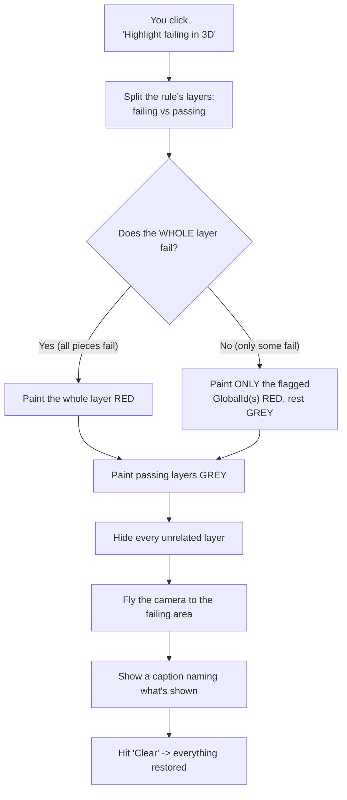

# 🔴 How the 3D highlight works (in plain English)

This explains what happens when you click **"Highlight failing in 3D"** — how the
app takes the part that failed an IDS rule and makes it **stand out in red** in
the 3D model.

> Sister document: `bcf-from-ids-workflow.md` explains how the same failing part
> gets written into a **BCF file**. This one is only about the **on‑screen 3D
> highlight**.

---

## 🧠 The simple idea

Imagine a Lego building where every brick has a barcode. You can't grab one brick
by asking for it, **but you can repaint bricks by barcode**. So to point at the
bad brick, the app:

1. **paints the failing part(s) red**,
2. **paints the related‑but‑OK parts grey**,
3. **hides everything else**, and
4. **flies the camera** over to it.

That's the whole trick: recolor + hide + fly there.

---

## 👣 Step by step (what happens when you click the button)

1. The app looks at the rule you clicked and splits its 3D layers into two piles:
   **failing** and **passing**.
2. For a layer where **only some** pieces fail (e.g. 1 slab out of 46), it picks
   the barcode(s) — the **GlobalId(s)** — of the failing piece(s).
3. It repaints the model:
   - **Failing pieces → RED.**
   - **Passing pieces in the same rule → GREY** (context, so you see what passed).
   - **Every unrelated building layer → HIDDEN.**
4. It **flies the camera** to frame the failing area.
5. A **caption** appears over the view saying exactly what you're looking at
   (e.g. "1 of 3 components fail…").
6. When you hit **Clear** (or close the panel), everything snaps back to normal —
   colors, visibility, and the timeline are all restored.

---

## 🗺️ The same thing as a picture

---

## 🎨 What the colors mean

| Color | Meaning |
|-------|---------|
| 🔴 **Red** | This piece **failed** the IDS rule (or is the representative flagged piece). |
| ⚪ **Grey** | This piece is part of the rule and **passed** — shown for context. |
| *(hidden)* | Not relevant to this rule — hidden so the red is unmistakable. |

---

## ❓ "Why just repaint it red? Why not make it glow?"

Because of **how these 3D layers work**. The model is served as cached
"scene layers." On those, the fancy tricks — a glowing halo, making things
see‑through, or a spotlight highlight — **simply don't show up**. The only things
that reliably work are:

- **repainting** a whole piece a new color, and
- **turning a layer on/off**.

The saving grace: every piece carries its **GlobalId** (its barcode), so the app
can repaint **just one piece** by its GlobalId — which is how you get **one red
slab** instead of the whole floor turning red.

---

## 1️⃣ One red piece vs. a whole red layer

- **Some pieces fail** (e.g. 45 of 46 slabs pass) → only the **flagged piece(s)**
  turn red, the rest of that layer stays grey.
- **The whole layer fails** (e.g. no slab has a fire rating) → the **entire
  layer** turns red.

> Honest note: because these layers only give us **counts** (not a list of exactly
> which pieces fail), for a partial failure the app paints a **representative**
> real piece red. Importantly, **it's the exact same piece that gets written into
> the BCF file** — so the 3D view and the BCF always agree.

---

## ⏱️ Why hidden/future parts still show up

The model has a construction **timeline** (4D). A failing part is often scheduled
for *later*, so at today's slider position it would normally be hidden. During a
highlight the app **temporarily reveals** the failing layers regardless of the
timeline — **without moving the timeline slider itself** — so you always see the
flagged part. Clearing the highlight puts the timeline filtering back.

---

## 🖱️ How to try it (click path)

1. Sign in to the app (it's behind the Private Preview login).
2. Click the **audit button (☑)** in the toolbar, then **"Run audit"**.
3. Expand a rule that shows **Fail** or **Partial** (e.g. **CT‑S06** or **CT‑S07**).
4. Click **"◎ Highlight failing in 3D."**
5. You'll see the flagged piece in **red**, related pieces in **grey**, everything
   else hidden, and the camera framed on it.
6. Click **Clear** to restore.

---

## 🔧 Where the code lives

All in **`audit.js`** (a copy is in this folder):
`handleHighlight` (decides failing vs passing + picks the red GlobalIds) →
`reviewLayers` → `beginReview` (does the recolor/hide and remembers the original
state so **Clear** can undo it). The red/grey looks come from `FAIL_RENDERER` /
`PASS_RENDERER` and `partialFailRenderer` (single‑piece red by GlobalId).

---

## ⚠️ Remember

- This file is a **local copy/snapshot** — it doesn't change the live app.
- **Local only** — nothing here is uploaded or shared.
