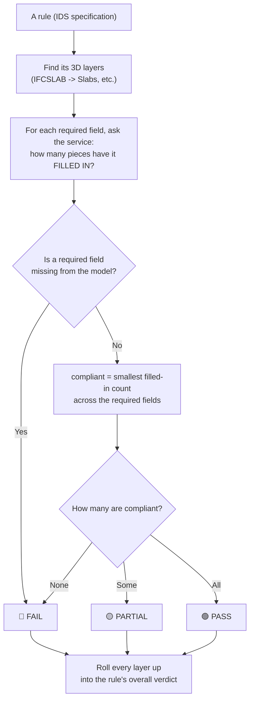

# ✅ How the audit decides Pass / Partial / Fail (plain English)

This explains how the app checks the 3D model against the **IDS** checklist and
gives each rule a **green (Pass) / amber (Partial) / red (Fail)** verdict —
**without opening every single element**.

> Sister documents: `how-the-3d-highlight-works.md` (turning a failure red in 3D)
> and `bcf-from-ids-workflow.md` (writing a failure into a BCF file). This one is
> about **how the Pass/Partial/Fail decision is made in the first place**.

---

## 🧠 The simple idea

An IDS is a **checklist** — for example: *"every slab must say whether it is
load‑bearing."*

The app does **not** inspect each slab one by one (the 3D service won't let it).
Instead, for each layer it asks the service a **summary question**:

> "Out of all your slabs, how many have the **LoadBearing** box filled in?"

Then it compares that count to the total number of slabs. That's the whole idea:
**count how many pieces have the required info filled in, and compare to the
total.**

---

## 🔑 Two words to know

- **Filled in** (a.k.a. *populated*): the piece has a value in the field the rule
  asks about.
- **Applicable**: how many pieces the rule applies to (e.g. all 46 slabs).

> ⚠️ Important: "filled in" means the info is **present** — **not** whether the
> value is *correct*. The audit checks that the box has something in it, not that
> the something is the right answer. (More on this in the limits below.)

---

## 👣 Step by step

1. The rule says which **IFC type** it applies to (e.g. `IFCSLAB`). The app finds
   the matching 3D layer (**Slabs**).
2. The rule lists what's **required** (e.g. `LoadBearing` **and** `IsExternal`).
   Each maps to a data field on that layer.
3. For **each required field**, the app asks the service: *how many pieces have
   this filled in?*
4. It works out the **layer verdict**:
   - If a required field **isn't even in the model** → **Fail**.
   - **compliant count** = the **smallest** "filled in" count across the required
     fields (a piece must have **all** of them, so the weakest field sets the
     limit).
   - **all** pieces filled in → **Pass**; **some** → **Partial**; **none** → **Fail**.
5. It **rolls up** all of the rule's layers into the rule's **overall** verdict.

---

## 🚦 The three verdicts

| Verdict | What it means | Example |
|---------|---------------|---------|
| 🟢 **Pass** | Every applicable piece has all the required info filled in. | All 46 slabs list their fire rating. |
| 🟡 **Partial** | Some pieces are filled in, but not all. | 45 of 46 slabs are load‑bearing‑tagged; 1 isn't. |
| 🔴 **Fail** | No pieces qualify, **or** a required field is missing from the model entirely. | No slab carries a classification code at all. |

---

## 🗺️ The same thing as a picture

---

## 🔎 A worked example — rule "CT‑S06"

- **Applies to:** Slabs, Columns, Walls.
- **Requires:** `LoadBearing` **and** `IsExternal` to be filled in.

| Layer | Filled in | Layer verdict |
|-------|-----------|---------------|
| Columns | all | 🟢 Pass |
| Walls | all | 🟢 Pass |
| Slabs | 45 of 46 | 🟡 Partial (1 slab is missing it) |

**Overall CT‑S06:** 2,386 of 2,387 pieces compliant → 🟡 **Partial**. That one
missing slab is exactly what the **3D highlight** paints red and what the **BCF**
export points at.

---

## ⚠️ Honest notes & limits

- **Presence, not correctness.** The audit confirms a required property is
  **filled in**; it does not (yet) check the value against an IDS restriction
  (an allowed list or pattern). A slab with `LoadBearing = "maybe"` still counts
  as filled in.
- **"Smallest count" is an approximation.** The service gives a **count per
  field**, not a per‑piece cross‑check. So "how many pieces have *both* required
  fields" is estimated by the **weakest field's** count. It's the honest best you
  can do from summary statistics.
- **Classification is an OR.** A classification rule is satisfied if **any** of the
  recognised code fields (`AssemblyCode` **or** `OmniClass`) is filled in.
- **Reads public summary numbers.** The counts come from the layers' public
  per‑attribute statistics, fetched **anonymously** — no login needed for the
  numbers themselves.

---

## 🖱️ How to see it

1. Click the **audit button (☑)** in the toolbar, then **"Run audit."**
2. Each rule shows a **Pass / Partial / Fail** chip and a line like
   **"2,386 of 2,387 elements compliant."**
3. Expand a rule to see the per‑layer breakdown and the evidence (e.g. the value
   range or the most common values found).

---

## 🔧 Where the code lives

All in **`audit.js`** (a copy is in this folder):
- `evaluateRequirement` — counts how many pieces have each required field filled in.
- `layerVerdict` — turns those counts into Pass / Partial / Fail for one layer.
- `runAudit` — resolves rules to layers and rolls everything up.
The name/field maps are in **`config.js`**.

---

## ⚠️ Remember

- This file is a **local copy/snapshot** — it doesn't change the live app.
- **Local only** — nothing here is uploaded or shared.
